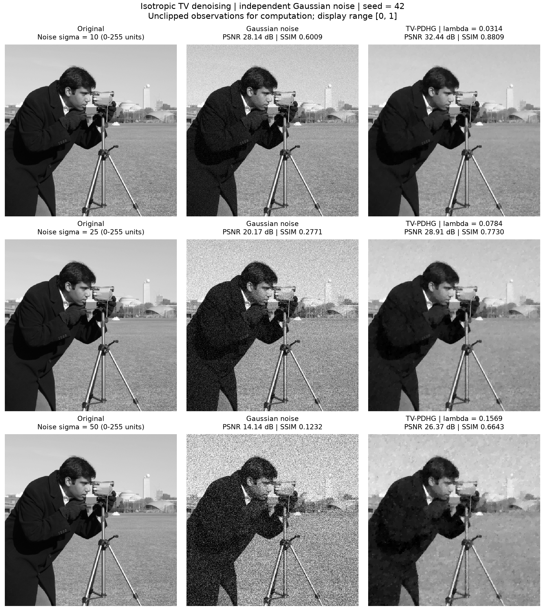

# TV 图像去噪作业：NumPy + PDHG

从磁盘读取随附的 512×512 灰度图 `test_image.png`，分别加入 sigma=10、25、50 的高斯噪声，使用手写 TV–PDHG 去噪，并计算 PSNR、SSIM。算法、指标及关键步骤的中文解释均在 [tv_denoise.py](tv_denoise.py) 中。

### 安装与运行

需要 **Python 3.10 或更高版本**。进入本目录后执行：

```bash
python -m pip install -r requirements.txt
python tv_denoise.py
```

实际验证版本：Python **3.11.16**、NumPy **2.4.6**、Matplotlib **3.11.1**。`requirements.txt` 保留最低版本约束，不是完整环境锁定文件。图片已随附，运行实验无需联网，也不会弹出绘图窗口。

### 模型与指标

将清晰图 x 归一化到 `[0,1]`，生成观测 `f=x+ε`，其中 `ε~N(0,(sigma/255)²)`。固定种子 42，为三组实验分配独立随机子流。计算时不裁剪观测，显示时统一使用 `[0,1]` 灰度范围。

求解带范围约束的各向同性 TV 模型：

```text
min  0.5 * Σ(u-f)² + λ * Σ sqrt((Dx u)² + (Dy u)²)
0 <= u <= 1
```

保真项限制结果偏离观测的程度，TV 项抑制灰度波动。采用前向差分、Neumann 边界和严格配对的伴随算子；PDHG 交替执行对偶球投影、图像近端更新与外推。默认 `λ=0.8*sigma/255`，两步长均为 0.35，满足 `8×0.35²=0.98<1`。每 25 次检查相对原始—对偶间隙，小于等于 `1e-4` 时停止，最多 3000 次；达到上限仍未收敛时会明确报告。

PSNR 为 `-10*log10(MSE)`，单位 dB；SSIM 使用 11×11 高斯窗口、窗口标准差 1.5、总体方差与协方差，并排除周围 5 像素的不完整窗口。两项指标固定 `data_range=1`，分别比较原图与噪声图、原图与去噪图。清晰原图只用于模拟加噪和评价，不参与求解、停止判断或参数选择。

### 参数与自定义图片

```bash
python tv_denoise.py --image my_image.png --sigmas 10 25 50 --output-dir my_results
python tv_denoise.py --help
```

| 参数 | 默认值与用途 |
| --- | --- |
| `--image` | 脚本旁的 `test_image.png`；支持灰度、RGB、RGBA，转换为灰度且不缩放，至少 11×11 |
| `--sigmas` | `10 25 50`，0–255 单位的非负噪声标准差 |
| `--seed` | `42`，非负整数随机种子 |
| `--weight` | 默认各取 `0.8*sigma/255`；指定时所有组共用非负权重 |
| `--max-iter` / `--tol` | `3000` / `1e-4`，迭代上限与相对间隙容差 |
| `--output-dir` | 脚本旁的 `results/`；再次运行覆盖该目录下的同名结果 |

保留 `--synthetic` 合成图选项及旧参数 `--noise-std`（归一化噪声标准差）、`--output`（PNG 路径）；详细用法见 `--help`。函数 `tv_pdhg(..., sigma=0.35)` 的 `sigma` 表示对偶步长。

### 实际效果与验收

使用随附 Camera 图片、默认参数和种子 42：

| sigma | 噪声 PSNR / dB | 去噪 PSNR / dB | 噪声 SSIM | 去噪 SSIM | 迭代次数 |
| --- | ---: | ---: | ---: | ---: | ---: |
| 10 | 28.1373 | **32.4446** | 0.600859 | **0.880901** | 250 |
| 25 | 20.1689 | **28.9143** | 0.277119 | **0.773029** | 425 |
| 50 | 14.1417 | **26.3667** | 0.123183 | **0.664298** | 525 |

**三组去噪 PSNR 均严格大于 25 dB，且 PSNR、SSIM 均有提升。** 三组均收敛，相对间隙分别约为 9.856e-5、9.449e-5、9.700e-5。高噪声下细纹理会被平滑；25 dB 是本次图片和配置的验收条件，更换图片后按实际结果报告。



### 输出与复核

| 文件 | 内容 |
| --- | --- |
| `results/comparison.png` | 三行三列对比图，标注噪声级别、TV 权重和两项指标 |
| `results/metrics.csv` | 效果表及权重、迭代次数、收敛状态、间隙、耗时；UTF-8 BOM，可用 Excel 打开 |
| `results/report.json` | 实验参数、软件版本、指标口径和完整迭代记录 |
| `results/images.npz` | 原图 `(H,W)`、噪声图与去噪图 `(N,H,W)`、噪声级别 `(N,)` 的完整浮点数据 |

```bash
python -m unittest -v test_tv_denoise.py
```

13 项数值测试覆盖伴随关系、解析解、边界约束、收敛状态、指标和随机可复现性。交付时从 NPZ 重算指标并核对 CSV、JSON、本文效果表及图中标注。复核应使用 NPZ 浮点数据；PNG 仅用于展示。相同配置可复现图像与指标，耗时会变化。

图片来源：`skimage.data.camera()`（Lav Varshney，CC0），运行本作业无需安装 scikit-image。算法参考：[Chambolle–Pock 原始—对偶算法](https://doi.org/10.1007/s10851-010-0251-1)。
